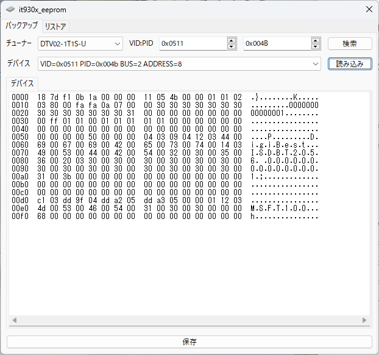
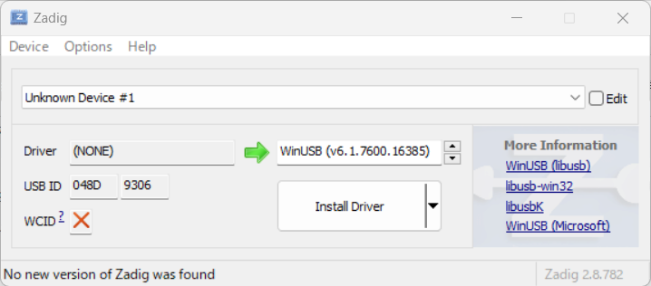
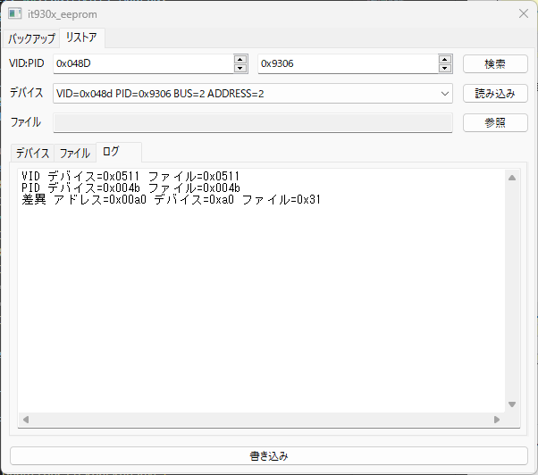

# it930x_eeprom_py

[e-Better](https://www.e-better.jp/)から販売されたDTV02-1T1S-Uに対して以下を行うプログラムです。

* デバイスをVID:PID=0x0511:0x004bで認識している状態でEEPROMのバックアップ
* デバイスをVID:PID=0x048d:0x9306で認識している状態でEEPROMのリストア

ただし、EEPROMのリストアには**EEPROMの中身が壊れる前、デバイスをVID:PID=0x0511:0x004bで正常に認識している状態でバックアップしたファイル**が必要です。

動作確認環境を以下に示します。

* バックアップ、リストアの両方
  * DTV02-1T1S-U
* バックアップのみ
  * PX-W3U4
* Windows 11
  * [python](https://www.python.org/) 3.11.9
  * [wxPython](https://wxpython.org/index.html) 4.2.1
  * [libusb1](https://github.com/vpelletier/python-libusb1) 3.1.0
  * [Zadig](https://zadig.akeo.ie/) 2.8
* Ubuntu 22.04
  * python 3.10.12
  * wxPython 4.0.7
  * libusb1 3.1.0

USB BridgeにITE IT930xを採用しているチューナーであれば動作すると思われますが自己責任でお願いします。

<!--
| チューナー            |  VID   |  PID   |
| :------------------- | :----: | :----: |
| PX-W3U4              | 0x0511 | 0x083f |
| PX-W3PE4             | 0x0511 | 0x023f |
| PX-W3PE5             | 0x0511 | 0x073f |
| PX-Q3U4              | 0x0511 | 0x084a |
| PX-Q3PE4             | 0x0511 | 0x024a |
| PX-Q3PE5             | 0x0511 | 0x074a |
| PX-MLT5PE            | 0x0511 | 0x024e |
| PX-MLT8PE3           | 0x0511 | 0x0252 |
| PX-MLT8PE5           | 0x0511 | 0x0253 |
| PX-M1UR              | 0x0511 | 0x0854 |
| PX-S1UR              | 0x0511 | 0x0855 |
| DTV02(A)-1T1S-U      | 0x0511 | 0x004b |
| DTV02(A)-1T1S-U 2309 | 0x0511 | 0x084b |
| DTV02A-4TS-P         | 0x0511 | 0x0254 |
| DTV02-5T-P           | 0x0511 | 0x024d |
-->

## インストール

### Windows

```batch
git clone https://github.com/hendecarows/it930x_eeprom_py.git
cd it930x_eeprom_py
python -m venv venv
venv\Scripts\activate.bat
pip install -r requirements.txt
python it930x_eeprom.py
```

### Linux

```console
git clone https://github.com/hendecarows/it930x_eeprom_py.git
cd it930x_eeprom_py
python3 -m venv venv
source venv/bin/activate
pip3 install -r requirements.txt
./it930x_eeprom.py
```

## Windowsでの動作方法

### EEPROMのバックアップ

EEPROMのバックアップにはWinUSBドライバがインストールされている必要があります。

#### WinUSB版px4_drvを使用している場合

WinUSBドライバが既にインストールされています。

#### 公式ドライバを使用している場合

公式ドライバをアンインストールし、[Zadig](https://zadig.akeo.ie/)を使用してWinUSBドライバをインストールして下さい。

#### バックアップ手順

* 「バックアップ」タブを選択します
* 「チューナー」コンボボックスからチューナーを選択します
* 「検索」ボタンを押してデバイスを検索します
* 「デバイス」コンボボックスからバックアップ元のデバイスを選択します
* 「読み込み」ボタンを押してデバイスのEEPROMを読み込みます
* 「保存」ボタンを押して保存します



### EEPROMのリストア

EEPROMのリストアには**EEPROMの中身が壊れる前、デバイスを正常に認識している状態でEEPROMをバックアップしたファイル**が必要です。バックアップファイルがない状態ではリストアできません。

#### WinUSBドライバのインストール

デバイスをVID:PID=0x048d:0x9306として認識している状態で[Zadig](https://zadig.akeo.ie/)でWinUSBドライバをインストールします。



#### リストア手順

* 「リストア」タブを選択します
* 「VID」を48d、「PID」を9306に設定します
* 「検索」ボタンを押してデバイスを検索します
* 「デバイス」コンボボックスからリストア先のデバイスを選択します
* 「読み込み」ボタンを押してデバイスのEEPROMを読み込みます
* 「参照」ボタンを押してバックアップファイルを選択します
* 「ログ」タブにデバイスとファイルの差分が表示されるので内容を確認します
* 「書き込み」ボタンを押して差分をEEPROMに書き込みます
* USBデバイスの安全な取り外し作業を行い再接続します



## Linuxでの動作方法

デバイスへのアクセス権が必要ですのでudevのルールファイルを作成して下さい。
サンプルがudevディレクトリ内にあります。EEPROMのバックアップ、リストア手順はWindowsと同じです。
